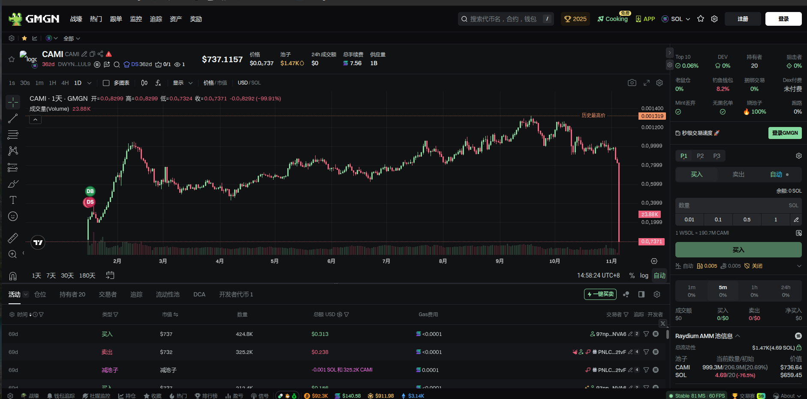
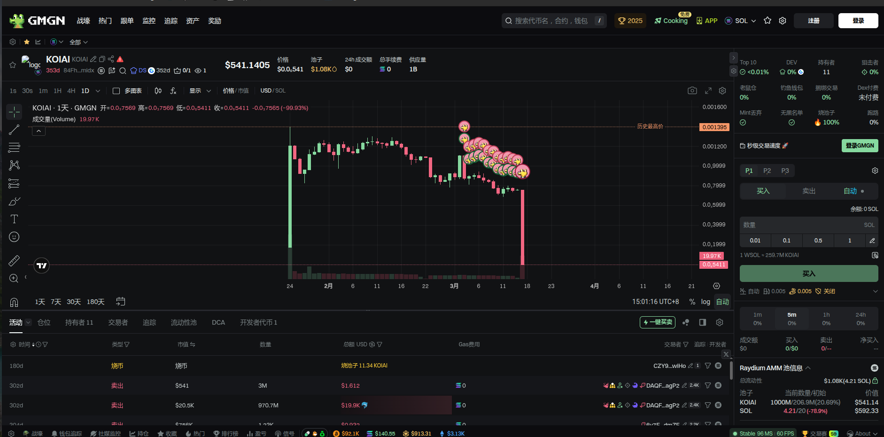

# MEME币做市工具合集

 <b> 严格保密，禁止复制! </b> 

|序号 | 工具  | 当前进度 | 开发语言 |
|--|---|--------| -- |
|01|[批量生成地址工具](./generate_address/)|100%| Python |
|02|[交易所批量提币工具(Gate.io)](./exchange_withdraw/) | 100% | TypeScript |
|03|[创建Token工具](./src/spl_token_create/) | 100% | TypeScript |
|04|[Raydium建池子+捆绑买入](./src/create_raydium_pool/create_pool_and_buy.ts) | 100%| TypeScript |
|05|[Token批量转账工具](./src/spl_m2m_token_transfer)| 100% | TypeScript|
|06|[SOL批量转账工具](./src/sol_m2m_transfer/) |100%| TypeScript|
|07|[OpenBook Market创建工具](./src/create_openbook_market/)|100%| TypeScript|
|08|[Raydium批量交易(拉升)](./src/trade_on_raydium/pump/) |  100% | TypeScript|
|09|[Raydium批量交易(下跌)](./src/trade_on_raydium/dump/) |  100% | TypeScript|
|10|[Raydium批量交易(刷量)](./src/trade_on_raydium/volume/) |  100% | TypeScript|
|11|[批量关闭账户回收租金](./src/spl_token_close_account/)| 100%| TypeScript|
|12|[销毁token](./src/burn_spl_token/)| 100%| TypeScript|
|13|[Token持仓分析](./src/get_token_holders/) | 100% | TypeScript|
|14|[Raydium新池子狙击工具](./src/trade_on_raydium/sniper) | 100% | TypeScript|
|15|[原地换手(刷数据)](./src/turnover/) | 100% | TypeScript|
|16|[回收资金](./src/spl_token_transfer_close/) | 100% | TypeScript|

# 运行

- 安装typescript依赖: `yarn`
- 安装python依赖:  `poetry shell && poetry install`
- 运行工具，例如运行批量Token转账的工具:
  - `cd src/spl_m2m_token_transfer`
  - `cp m2m.csv.example m2m.csv`
  - 填写csv文件
  - `ts-node m2m.ts`

# 实战案例

#### CAMI
CAMI项目从2025年1月，运行到2025年11月撤池子。

- https://gmgn.ai/sol/token/DWYNRC2FFBRFAuifHYmyDG6427sBqjKS1NBsdnfpLUL9

#### Koiai
- https://gmgn.ai/sol/token/84FhSgZexvSf2pjGGRSiAWtvJJHZcS6VVrXhJmqYmidx

