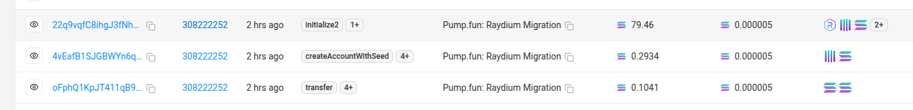

如何设置 `Minimum order size` 和 `Minimum price tick size`


- Minimum order size : token的最小单位
- Minimum price tick size:  价格变化最小单位


简单点， 两个参数的小数点位数之和不能大于6, 必须小于等于6, 大于0
> 直接参考: https://docs.raydium.io/raydium/updates/archive/creating-an-openbook-amm-pool#how-to-create-a-permissionless-pool

例如， 如果 order size 设置为 1 (小数点为数0), 那么 price tick size 应该设置为 0.000001 (小数点为数为6)
例如， 如果 order size 设置为 0.1 (小数点为数1), 那么 price tick size 应该设置为 0.00001 (小数点为数为5)
例如， 如果 order size 设置为 0.01 (小数点为数2), 那么 price tick size 应该设置为 0.0001 (小数点为数为4)


- https://github.com/sayantank/serum-explorer/blob/444659b4920fba4ce16d3bdd2649e593f04ffe5f/pages/market/create/advanced.tsx#L75
```js
const baseLotSize = Math.round(
10 ** baseMint.decimals * Math.pow(10, -1 * data.lotSize)
);

const quoteLotSize = Math.round(
10 ** quoteMint.decimals *
    Math.pow(10, -1 * data.lotSize) *
    Math.pow(10, -1 * data.tickSize)
);
```

----------


(推荐)使用, 可以自定义 market的参数
- https://serum-explorer.vercel.app/market/create
- 调整以下参数来降低创建OpenBook的费用
  - Event Queue Length , 推荐 `128`
  - Request Queue Length , 推荐 `9`
  - Orderbook Length,  推荐`201`


也可以使用(非常贵，需要 2.78 SOL)：
- https://v2.raydium.io/create-market/


也可以使用：
https://slerf.tools/zh-cn/openbook-market/solana


-------------

pump.fun 的迁移，是将3笔交易进行捆绑
